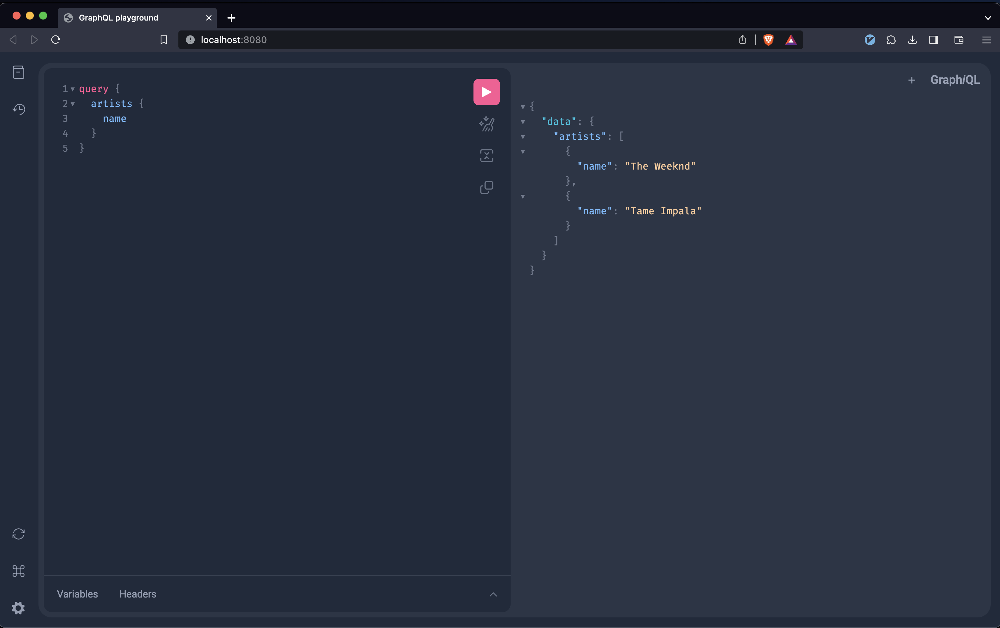

## Introduction

In the ever-evolving landscape of web development, GraphQL has emerged as a powerful alternative to traditional RESTful APIs. 

Its flexibility and efficiency have led many developers to consider migrating their REST endpoints to GraphQL. In this blog post, we will explore the process of converting a RESTful endpoint to GraphQL, unlocking the benefits of a more customizable and efficient data-fetching experience. 

Join us on this journey as we delve into the world of GraphQL and transform a RESTful API into a GraphQL powerhouse.

## Rest API Implementation

Let's say that we have a server with a REST Endpoint structured as below.

```bash
curl http://localhost:8080/artists
```

and it returns 

```json
[
  {
    "name": "The Weeknd",
    "age": 30,
    "tracks": [
      {
        "name": "Creepin",
        "duration": 222
      }
    ]
  },
  {
    "name": "Tame Impala",
    "age": 30,
    "tracks": [
      {
        "name": "Let It Happen",
        "duration": 467
      }
    ]
  }
]
```

This endpoint simply can be handled by this below code.

```go
package main

import (
	"encoding/json"
	"log"
	"net/http"
)

type Track struct {
	Name     string `json:"name"`
	Duration int    `json:"duration"` // in seconds
}

type Artist struct {
	Name   string  `json:"name"`
	Age    int     `json:"age"`
	Tracks []Track `json:"tracks"`
}

var data = []Artist{
	{
		Name: "The Weeknd",
		Age:  30,
		Tracks: []Track{
			{Name: "Creepin", Duration: 222},
		},
	},
	{
		Name: "Tame Impala",
		Age:  35,
		Tracks: []Track{
			{Name: "Let It Happen", Duration: 467},
		},
	},
}

func main() {
	mux := http.NewServeMux()
	mux.HandleFunc("/artists", func(w http.ResponseWriter, r *http.Request) {
		if err := json.NewEncoder(w).Encode(&data); err != nil {
			return
		}
	})

	log.Fatal(http.ListenAndServe(":8080", mux))
}
```


### Structure Change


But you only want some of the fields maybe like

```json
[
  {
    "name": "The Weeknd",
    "tracks": [
      {
        "name": "Creepin",
      }
    ]
  },
  {
    "name": "Tame Impala",
    "tracks": [
      {
        "name": "Let It Happen",
      }
    ]
  }
]
```

You want to make it as a GraphQL query maybe something like

```
query {
    getArtists {
        name
        tracks {
            name
        }
    }
}
```

Question is how to change this really simple API to a graphQL endpoint.

## GraphQL Implementation

For this we will use the package of `https://github.com/99designs/gqlgen`, you can have a look.

To start the project, we will follow the quick quide.

1. First create the project
```bash
mkdir example
cd example
go mod init example
```

2. Add 99designs/gqlgen to your project's tools.go
```bash
printf '// +build tools\npackage tools\nimport (_ "github.com/99designs/gqlgen"\n _ "github.com/99designs/gqlgen/graphql/introspection")' | gofmt > tools.go

go mod tidy
```

3. Initialise gqlgen config and generate models
```bash
go run github.com/99designs/gqlgen init

go mod tidy
```

Start the graphql server
```bash
go run server.go
```

### Project structure 

Your folder structure should look like this

```bash
├── go.mod
├── go.sum
├── gqlgen.yml
├── graph
│   ├── generated.go
│   ├── model
│   │   └── models_gen.go
│   ├── resolver.go
│   ├── schema.graphqls
│   └── schema.resolvers.go
├── server.go
└── tools.go

```

### Generated Code and GraphiQL Playground

Your server.go will look like this

```go
package main

import (
	"log"
	"net/http"
	"os"

	"github.com/99designs/gqlgen/graphql/handler"
	"github.com/99designs/gqlgen/graphql/playground"
	"github.com/garythacker/graph/graph"
)

const defaultPort = "8080"

func main() {
	port := os.Getenv("PORT")
	if port == "" {
		port = defaultPort
	}

	srv := handler.NewDefaultServer(graph.NewExecutableSchema(graph.Config{Resolvers: &graph.Resolver{}}))

	http.Handle("/", playground.Handler("GraphQL playground", "/query"))
	http.Handle("/query", srv)

	log.Printf("connect to http://localhost:%s/ for GraphQL playground", port)
	log.Fatal(http.ListenAndServe(":"+port, nil))
}
```

When you run all of the commands above and run the project you should see something like this on your project


We will be testing our query from the UI to easily see the results.

### GraphQL File

There is an autogenerated file `schema.graphqls`, we will be setting our `Artist` and `Track` models here.

```graphql
type Artist {
  name: String!
  age: Int!
  tracks: [Track!]!
}

type Track {
  name: String!
  duration: Int!
}

type Query {
  artists: [Artist!]!
}
```

Then run below command to auto-generate models resolver etc, we will just fill the logic.


```bash
go run github.com/99designs/gqlgen generate
```

Then the `schema.resolvers.go` file will be like this

```go
package graph

// This file will be automatically regenerated based on the schema, any resolver implementations
// will be copied through when generating and any unknown code will be moved to the end.
// Code generated by github.com/99designs/gqlgen version v0.17.36

import (
	"context"
	"fmt"

	"github.com/garythacker/graph/graph/model"
)

// Artists is the resolver for the artists field.
func (r *queryResolver) Artists(ctx context.Context) ([]*model.Artist, error) {
	panic(fmt.Errorf("not implemented: Artists - artists"))
}

// Query returns QueryResolver implementation.
func (r *Resolver) Query() QueryResolver { return &queryResolver{r} }

type queryResolver struct{ *Resolver }
```

We will fill the `Artists` method, it will be a simple returning array of `model.Artist` which is in the `model/models_gen.go` (auto-generated file)

```go
// Code generated by github.com/99designs/gqlgen, DO NOT EDIT.

package model

type Artist struct {
	Name   string   `json:"name"`
	Age    int      `json:"age"`
	Tracks []*Track `json:"tracks"`
}

type Track struct {
	Name     string `json:"name"`
	Duration int    `json:"duration"`
}
```

### Implementation of the Resolver

To implement the resolver we will return a hardcoded array of `model.Artist` struct.

```go
package graph

// This file will be automatically regenerated based on the schema, any resolver implementations
// will be copied through when generating and any unknown code will be moved to the end.
// Code generated by github.com/99designs/gqlgen version v0.17.36

import (
	"context"

	"github.com/garythacker/graph/graph/model"
)

var data = []*model.Artist{
	{
		Name: "The Weeknd",
		Age:  30,
		Tracks: []*model.Track{
			{Name: "Creepin", Duration: 222},
		},
	},
	{
		Name: "Tame Impala",
		Age:  60,
		Tracks: []*model.Track{
			{Name: "Let It Happen", Duration: 467},
		},
	},
}

// Artists is the resolver for the artists field.
func (r *queryResolver) Artists(ctx context.Context) ([]*model.Artist, error) {
	return data, nil
}

// Query returns QueryResolver implementation.
func (r *Resolver) Query() QueryResolver { return &queryResolver{r} }

type queryResolver struct{ *Resolver }
```

Let's run the server again and go to **GraphiQL playground (http://localhost:8080/)**.

```bash
go run server.go
```

Then go to `http://localhost:8080` and paste the query 

```
query {
  artists {
    name
  }
}
```

it will return 

```json
{
  "data": {
    "artists": [
      {
        "name": "The Weeknd"
      },
      {
        "name": "Tame Impala"
      }
    ]
  }
}
```



You can play with the editor and convert your rest endpoints to GraphQL easily.

## REFERENCES

In summary, transitioning from REST to GraphQL offers numerous benefits for your API. It's a journey worth taking, promising improved efficiency and flexibility. So, take that step, and may your GraphQL journey be both rewarding and transformative. Happy coding!

- https://github.com/99designs/gqlgen